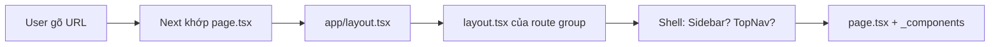
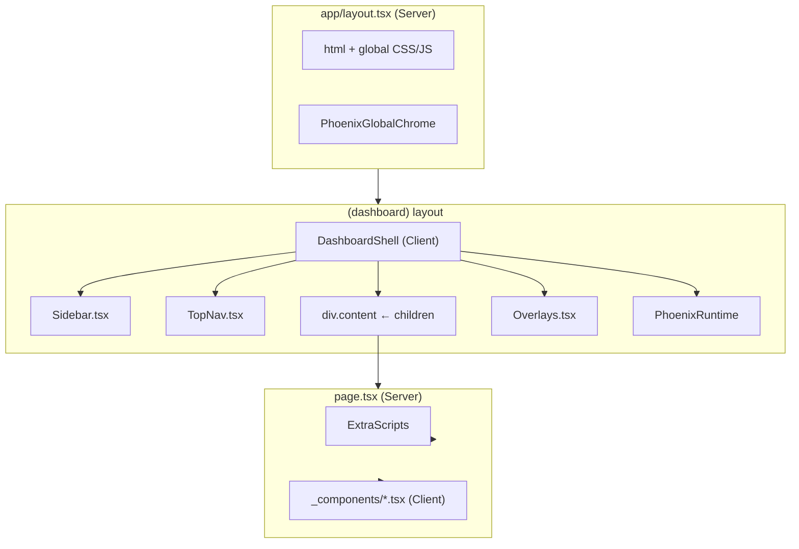

# Hướng dẫn dự án Phoenix Next.js

Tài liệu này mô tả **toàn bộ đường dẫn** và cách tổ chức dự án `phoenix-nextjs` sau khi convert từ template gốc `phoenix-react`. Mục tiêu: biết **đọc file nào trước**, **sidebar/header ở đâu**, **luồng render**, **import thế nào**, và **vì sao** cấu trúc như vậy.

---

## 1. Bức tranh tổng thể

### 1.1 Hai dự án trong workspace

| Thư mục | Vai trò thực tế |
|---------|------------------|
| `phoenix-react/` | Template **Gulp + Pug + SCSS + JS** — build ra HTML tĩnh. **Không phải** React SPA, **không có** `react-router`. |
| `phoenix-nextjs/` | Cùng template đó được **port sang Next.js 16 (App Router)** — ~220 route, giữ Bootstrap 5, vendors, Echarts, Mapbox, v.v. |

> **Lưu ý quan trọng:** Tên `phoenix-react` gây hiểu nhầm. Cả hai repo đều dùng Gulp compile `src/` → `public/`. Next.js chỉ **thay thế lớp routing + render trang** bằng React; phần theme/assets vẫn build bằng Gulp.

### 1.2 Convert đã làm gì?

```
phoenix-react                          phoenix-nextjs
─────────────────────────────────────────────────────────────
src/pug/*.pug          ──Gulp──►     public/**/*.html
                                      │
                                      ▼
                              scripts/convert-pages.mjs
                                      │
                                      ▼
                              app/**/page.tsx + _components/*.tsx
                              app/(dashboard)/_components/shell/*.tsx
```

- **Giao diện:** Giữ class Bootstrap, HTML gần như nguyên bản.
- **Link:** `<a href="foo.html">` → `PhoenixLink` (`next/link`, bỏ `.html`).
- **Ảnh:** `` → `PhoenixImage` (`next/image`, `unoptimized: true` để không lệch CSS).
- **Layout:** Tách chrome (sidebar + top nav) khỏi nội dung trang, bọc bằng layout Next.js.

### 1.3 Hai “engine” chạy song song

| Engine | Lệnh | Việc làm |
|--------|------|----------|
| **Next.js** | `npm run dev` | Serve app React, routing, client navigation |
| **Gulp** | `npm run dev:gulp` / `build:gulp` | Compile SCSS, Pug, copy vendors → `public/` |

Khi dev hàng ngày: **`npm run dev`** (Next). Chỉ cần Gulp khi sửa `src/scss`, `src/pug`, hoặc cần regenerate HTML rồi chạy `convert:pages`.

---

## 2. Cây thư mục gốc (`phoenix-nextjs/`)

```
phoenix-nextjs/
├── app/                    ← ROUTING + LAYOUT Next.js (đọc đây trước)
├── components/             ← UI dùng chung (PhoenixLink, scripts, …)
├── lib/                    ← Logic TS thuần (script chain, route helpers)
├── public/                 ← Static: CSS/JS/img từ Gulp + HTML gốc
├── src/                    ← Nguồn Gulp (pug, scss, js) — KHÔNG phải code Next
├── scripts/                ← Tool convert HTML → TSX
├── gulp/                   ← Task Gulp
├── types/                  ← Khai báo TypeScript (css modules)
├── next.config.ts
├── tsconfig.json           ← alias @/* → thư mục gốc project
├── proxy.ts                ← Redirect .html → route sạch
├── vendors.json            ← Map npm package → public/vendors/
├── gulpfile.js
└── package.json
```

**Bỏ qua khi đọc code:** `.next/`, `node_modules/`, `build/` (artifact build).

---

## 3. Alias import: `@/`

Trong `tsconfig.json`:

```json
"paths": { "@/*": ["./*"] }
```

| Import | Trỏ tới |
|--------|---------|
| `@/components/ui/phoenix-link` | `phoenix-nextjs/components/ui/phoenix-link.tsx` |
| `@/app/(dashboard)/_components/shell` | Shell dashboard |
| `@/lib/phoenix-script-chain` | `lib/phoenix-script-chain.ts` |

**Quy tắc:** `@/` = **root project** `phoenix-nextjs/`, không phải `src/`.

`src/js`, `src/pug`, `src/scss` bị **exclude** khỏi TypeScript — đó là source Gulp, không import trực tiếp vào component React.

---

## 4. Routing — Next “biết” chạy Home + Dashboard thế nào?

### 4.1 Không có chuyện “dashboard render trước, minimal sau”

Next.js **không** chạy lần lượt `(dashboard)` → `(standalone)` → `(minimal)` rồi chọn cái nào.

Cơ chế thật:

1. User gõ **một URL** (vd. `/`, `/apps/chat`, `/pages/landing/default`).
2. Next **khớp URL** với **đúng một** file `page.tsx` trong cây `app/`.
3. Next **lồng mọi** `layout.tsx` từ **ngoài vào trong** trên đường dẫn thư mục tới file `page.tsx` đó.

```
URL khớp page.tsx  →  layout cha bọc ngoài  →  layout con  →  nội dung page
```

**Route group** `(dashboard)`, `(standalone)`, `(minimal)` chỉ là **tên folder** — **không** có trong URL, **không** có thứ tự ưu tiên. Chúng dùng để **tách** layout khác nhau cho các nhóm trang.

### 4.2 Vì sao `/` mặc định = Home **có** Sidebar + Header?

| Câu hỏi | Trả lời |
|---------|---------|
| File nào phục vụ `/`? | `app/(dashboard)/page.tsx` |
| Vì sao không phải `app/page.tsx`? | Không tồn tại `app/page.tsx` ở root — chỉ có `page.tsx` **bên trong** `(dashboard)` |
| `(dashboard)` có trong URL không? | **Không** — folder `(tên)` = route group, bị ẩn |
| Layout nào bọc `/`? | `app/layout.tsx` **rồi** `app/(dashboard)/layout.tsx` |
| Sidebar/Header từ đâu? | `(dashboard)/layout.tsx` → `DashboardShell` → `Sidebar` + `TopNav` |
| Nội dung giữa màn hình? | `page.tsx` render `<Home />` từ `_components/Home.tsx` |

**Map file → URL (ví dụ):**

| File `page.tsx` | URL |
|-----------------|-----|
| `app/(dashboard)/page.tsx` | `/` |
| `app/(dashboard)/apps/chat/page.tsx` | `/apps/chat` |
| `app/(dashboard)/dashboard/crm/page.tsx` | `/dashboard/crm` |
| `app/(standalone)/showcase/page.tsx` | `/showcase` |
| `app/(standalone)/pages/landing/default/page.tsx` | `/pages/landing/default` |

Next **không** “quyết định mặc định là dashboard”. Developer **đặt** trang chủ tại `app/(dashboard)/page.tsx` khi convert — tương ứng `public/index.html` (trang e-commerce dashboard có `navbar-vertical`).

### 4.3 Ba nhóm layout — `(dashboard)`, `(standalone)`, `(minimal)`

| Nhóm | Folder layout | Shell | Có Sidebar + TopNav dashboard? | Số `page.tsx` (ước lượng) |
|------|---------------|-------|--------------------------------|---------------------------|
| **dashboard** | `app/(dashboard)/layout.tsx` | `DashboardShell` | **Có** | ~190 |
| **standalone** | `app/(standalone)/layout.tsx` | `StandaloneShell` | **Không** | ~30 |
| **minimal** | `app/(minimal)/layout.tsx` | `MinimalShell` | **Không** | **0** (chưa convert trang nào vào đây) |

**Vì sao tách?** Template gốc có nhiều kiểu trang:

- Dashboard admin → có menu dọc + header (`LayoutContent.pug`).
- Landing / storefront khách → full page, navbar riêng hoặc không menu admin.
- Auth / error → thường full màn hình, **không** sidebar admin.

Nếu gắn Sidebar vào `app/layout.tsx` (root) → **mọi** URL đều có menu trái → sai.

### 4.4 `(minimal)` là gì?

**Định nghĩa trong project:** Layout cho trang **full viewport**, **không** chrome dashboard (sidebar, top nav admin).

**File hiện có:**

- `app/(minimal)/layout.tsx` → `MinimalShell` — chỉ `<main>{children}</main>` + `PhoenixScriptsProvider`.
- `app/(minimal)/_components/shell/index.tsx` — shell tối giản.

**Chưa có:** bất kỳ `app/(minimal)/**/page.tsx` nào → **không URL nào** dùng minimal lúc này.

**Logic khi convert** (`scripts/convert-pages.mjs` — `detectLayoutType()`):

```javascript
// Có navbar-vertical → dashboard
if (mainHtml.includes('navbar-vertical')) return 'dashboard';

// Không sidebar + min-vh-100 + (404|403|500|authentication) → minimal
if (min-vh-100 && !navbar-vertical && (404|403|500|authentication)) return 'minimal';

// Còn lại → standalone
return 'standalone';
```

**Gap hiện tại:** Trang sign-in, 404, … vẫn được ghi vào `(dashboard)/pages/...` (có sidebar) vì convert/lần phân loại chưa chuyển hết sang `(minimal)`. Muốn đúng template: di chuyển route hoặc chạy lại convert với HTML auth/error thuần.

### 4.5 Cây layout lồng nhau (mọi trường hợp)

```
app/layout.tsx                    ← LUÔN chạy (mọi URL)
    │
    ├── [URL thuộc (dashboard)]
    │       app/(dashboard)/layout.tsx  → DashboardShell
    │           └── page.tsx + _components
    │
    ├── [URL thuộc (standalone)]
    │       app/(standalone)/layout.tsx → StandaloneShell
    │           └── page.tsx + _components
    │
    └── [URL thuộc (minimal) — khi có page]
            app/(minimal)/layout.tsx    → MinimalShell
                └── page.tsx + _components
```

**Chỉ một nhánh** được kích hoạt — theo **vị trí file `page.tsx`**, không theo thứ tự folder.

---

## 5. Luồng render — đọc theo thứ tự này

### 5.1 Sơ đồ layout lồng nhau

```
app/layout.tsx                          [SERVER - root HTML, CSS global]
    │
    ├── app/(dashboard)/layout.tsx      [SERVER → DashboardShell CLIENT]
    │       └── page.tsx + _components/*.tsx
    │
    ├── app/(standalone)/layout.tsx     [SERVER → StandaloneShell CLIENT]
    │       └── page.tsx (landing, e-commerce storefront, …)
    │
    └── app/(minimal)/layout.tsx        [SERVER → MinimalShell CLIENT]
            └── (chưa có page — dự phòng auth/error không chrome)
```

**Route group** `(dashboard)`, `(standalone)`, `(minimal)` **không xuất hiện trên URL**.

Ví dụ: file `app/(dashboard)/apps/chat/page.tsx` → URL `/apps/chat`.

### 5.2 Root layout — `app/layout.tsx`

**Vai trò:** Khung HTML toàn site (tương đương `src/pug/layouts/Layout.pug` bên gốc).

- `<html>`, font Google, **toàn bộ CSS theme** (`/assets/css/theme.min.css`, RTL, user.css, leaflet, simplebar, …).
- Script `PHOENIX_LAYOUT_INIT` trong `<head>`: đọc `localStorage` (dark mode, collapse sidebar, nav type) **trước khi paint** — tránh FOUC.
- `config.js`, `simplebar` — `beforeInteractive`.
- `{children}` — nội dung từ layout con.
- Cuối `<body>`: `PhoenixGlobalChrome` (theme customizer offcanvas), `PhoenixLayoutReady`, `PhoenixRtl`.

**Không có** `'use client'` — đây là Server Component.

### 5.3 Dashboard layout — Sidebar + Header (TopNav)

**File layout mỏng:**

`app/(dashboard)/layout.tsx` → import `DashboardShell` từ `app/(dashboard)/_components/shell/`.

**Chrome thật sự nằm ở đây (KHÔNG phải `components/layouts/`):**

| File | Vai trò | Tương đương Pug gốc |
|------|---------|---------------------|
| `shell/Sidebar.tsx` | Menu dọc trái (`navbar-vertical`) | `+NavbarVertical` trong `LayoutContent.pug` |
| `shell/TopNav.tsx` | Header trên (`navbar-top`, search, avatar, …) | `+TopNav` trong `LayoutContent.pug` |
| `shell/Overlays.tsx` | Modal search, support chat, … | `block afterContent` / overlays |
| `shell/index.tsx` | Ghép DOM + providers | Toàn bộ `LayoutContent` mixin |

**Thứ tự DOM trong `shell/index.tsx`** (giống HTML tĩnh):

```tsx
<main className="main" id="top">
  <Sidebar />           {/* menu trái */}
  <TopNav />            {/* header trên */}
  <div className="content">{children}</div>             {/* slot: page.tsx render vào đây */}
  <Overlays />
  <PhoenixRuntime />    {/* load chuỗi script Phoenix */}
  <PhoenixVerticalNavSync />
</main>
```

**Footer:** Template gốc có `+Footer` **tùy từng trang** trong block content — **không** có footer global trong shell. Tìm footer trong file `_components/*.tsx` của từng page nếu có.

### 5.4 Standalone layout

`app/(standalone)/layout.tsx` → `StandaloneShell`:

- Chỉ `<main>{children}</main>` + `PhoenixNavbarInit`.
- **Không** có Sidebar/TopNav dashboard.
- Dùng cho: landing marketing, e-commerce **khách hàng**, travel agency customer, showcase, demo navbar ngang.

### 5.5 Minimal layout

`app/(minimal)/layout.tsx` → `MinimalShell`:

- `<main>{children}</main>` thuần, không script navbar phức tạp.
- **Ý định:** trang auth (sign-in), error 403/404/500 **không** sidebar.
- **Hiện trạng:** Các trang auth/error vẫn nằm dưới `(dashboard)/pages/...` nên **vẫn có sidebar** — gap so với template tĩnh (cần chuyển route sang `(minimal)` nếu muốn đúng gốc).

### 5.6 Một trang cụ thể — pattern chuẩn

Ví dụ trang chủ `app/(dashboard)/page.tsx`:

```tsx
// SERVER — metadata + khai báo script trang
export const metadata = { title: "Phoenix" };
export default function Page() {
  return (
    <>
      <ExtraScripts scripts={["/vendors/echarts/...", "/assets/js/dashboards/..."]} />
      <Home />   {/* CLIENT — HTML convert */}
    </>
  );
}
```

`app/(dashboard)/_components/Home.tsx` — `'use client'`, chứa bulk HTML đã convert.

**Quy tắc đọc một route bất kỳ:**

1. Mở `app/.../page.tsx` — xem `metadata`, `ExtraScripts`, import component nào.
2. Mở `app/.../_components/<Tên>.tsx` — **toàn bộ UI trang** nằm đây.
3. Sidebar/TopNav **không** sửa trong page — sửa ở `shell/` nếu đổi menu global.

---

## 6. Ba nhóm route (route groups)

### 6.1 `(dashboard)` — ~190 trang

URL không có prefix `(dashboard)`. Bao gồm:

| Nhánh URL | Nội dung |
|-----------|----------|
| `/` | E-commerce dashboard (home) |
| `/dashboard/*` | CRM, stock, project-management, travel-agency |
| `/apps/*` | Chat, calendar, CRM, e-commerce admin, email, file-manager, gallery, kanban, PM, social, stock, travel hotel admin, events, gantt |
| `/modules/components/*` | Demo Bootstrap components |
| `/modules/forms/*`, `/modules/tables/*`, `/modules/utilities/*`, `/modules/icons/*`, `/modules/echarts/*` | Form, table, utility, icon, chart demos |
| `/pages/*` | Starter, timeline, members, notifications, pricing, FAQ, **errors**, **authentication** |
| `/documentation/*` | Docs template |
| `/demo/*` | Demo vertical nav, dark mode, combo nav, … |
| `/widgets`, `/changelog`, `/coming-soon`, `/upcoming` | Misc |

**Cấu trúc file lặp lại:**

```
app/(dashboard)/apps/chat/
├── page.tsx                 ← wrapper server (mỏng)
└── _components/
    └── Chat.tsx             ← nội dung (client, HTML convert)
```

### 6.2 `(standalone)` — ~30 trang

| Nhánh URL | Nội dung |
|-----------|----------|
| `/showcase` | Showcase |
| `/pages/landing/default`, `alternate` | Landing marketing |
| `/demo/navbar-horizontal`, `horizontal-slim`, `dual-nav` | Demo layout ngang |
| `/apps/e-commerce/landing/*` | Storefront khách (cart, checkout, product-details, …) |
| `/apps/travel-agency/*` | Flight/hotel/trip **customer** flows |

### 6.3 `(minimal)` — layout only

Chưa có `page.tsx`. `lib/phoenix/layout-types.ts` và `convert-pages.mjs` dùng `detectLayoutType()` để phân loại HTML khi convert.

---

## 7. So sánh layout: gốc Pug vs Next.js

### 7.1 Phoenix-react (gốc)

| Layer | File |
|-------|------|
| Document | `src/pug/layouts/Layout.pug` |
| Dashboard chrome | `src/pug/mixins/layouts/LayoutContent.pug` — `+NavbarVertical`, `+TopNav`, `.content` |
| Biến thể | `LayoutTheme.pug`, `LayoutShowcase.pug`, `LayoutEcommerce.pug`, `LayoutSplitAuth.pug`, … |
| Trang | `src/pug/apps/chat.pug`, `src/pug/dashboard/crm.pug`, … |
| Output | Gulp → `public/apps/chat.html`, … |

**Điều hướng:** Click `<a href="...html">` → **full page reload**.

### 7.2 Phoenix-nextjs (sau convert)

| Layer | File |
|-------|------|
| Document + CSS | `app/layout.tsx` |
| Dashboard chrome | `app/(dashboard)/_components/shell/*` |
| Standalone | `app/(standalone)/_components/shell/index.tsx` |
| Trang | `app/**/page.tsx` + `_components/*.tsx` |
| Điều hướng | `PhoenixLink` → client navigation + reload script chain |

`scripts/convert-pages.mjs` có `extractChromeParts()` / `extractDashboardContent()` — tách HTML tĩnh giống cách Pug tách `LayoutContent` vs `block content`.

---

## 8. Thư mục `components/`

### 8.1 `components/ui/` — **đang dùng thật**

| File | Mục đích |
|------|----------|
| `phoenix-link.tsx` | `next/link`, bỏ `.html`, tự `active` theo `usePathname` |
| `phoenix-image.tsx` | `next/image` hoặc fallback `` khi CSS sizing phức tạp |
| `phoenix-scripts-context.tsx` | Provider: load vendor JS theo route, không reload full page |
| `phoenix-runtime.tsx` | Gắn script chain + navbar init trên dashboard |
| `phoenix-global-chrome.tsx` | Theme customizer (offcanvas) toàn site |
| `extra-scripts.tsx` | Trang đăng ký thêm script (render `null`) |
| `phoenix-layout-ready.tsx` | Class `phoenix-layout-ready` sau hydrate |
| `phoenix-rtl.tsx` | Toggle RTL stylesheet |
| `phoenix-vertical-nav-sync.tsx` | Đồng bộ trạng thái nav dọc |
| `phoenix-navbar-init.tsx` | Bootstrap navbar behaviors |
| `phoenix-page.tsx` | Wrapper optional “chờ script ready” |
| `phoenix-fontawesome.tsx` | Font Awesome i2svg |

Tất cả file trên có `'use client'` (trừ khi chỉ re-export).

### 8.2 `components/layouts/` và `components/phoenix/` — **legacy**

- `layouts/DashboardLayout.tsx`, `generated/DashboardChrome.tsx` — bản generate **cũ**, **App Router không wire** các file này.
- `phoenix/PhoenixLink.tsx`, … — **trùng** `components/ui/`, shell dùng `ui/`.

**Khi sửa link/ảnh:** chỉnh `components/ui/`, không nhầm sang `components/phoenix/`.

---

## 9. Thư mục `lib/`

| File | Mục đích |
|------|----------|
| `phoenix-script-chain.ts` | `PHOENIX_CORE_VENDORS`, `loadScriptsSequential`, `buildPhoenixScriptChain` — thứ tự load Bootstrap, Popper, Phoenix.js, script từng trang |
| `phoenix/routes.ts` | `htmlPathToRoute`, `resolveHtmlHref` — map path HTML cũ |
| `phoenix/layout-types.ts` | `detectLayoutType()` → `dashboard` \| `minimal` \| `standalone` |

Dùng bởi `phoenix-scripts-context.tsx` — mỗi lần đổi route Next.js, load lại script trang mà không F5.

---

## 10. Thư mục `public/`

| Path | Nội dung |
|------|----------|
| `public/assets/css/` | `theme.min.css`, RTL, `phoenix-critical-layout.css`, `user.min.css` |
| `public/assets/js/` | `config.js`, `phoenix.js`, `dashboards/*`, `pages/*` |
| `public/assets/img/` | Logo, favicon, illustrations |
| `public/assets/data/` | Geo JSON (world, usa) |
| `public/vendors/` | Bootstrap, echarts, mapbox, tinymce, … (copy từ `vendors.json` + Gulp) |
| `public/**/*.html` | **Nguồn** cho `npm run convert:pages` |

**Ảnh trong TSX:** path `/assets/img/...` (từ root `public/`).

---

## 11. Thư mục `src/` (Gulp — không phải Next)

```
src/
├── pug/          ← Template trang + mixins (mirror cấu trúc site)
├── scss/         ← Theme Phoenix
└── js/           ← phoenix.js + pages/*.js
```

| | `src/` | `app/` + `components/` |
|--|--------|-------------------------|
| Build bởi | Gulp | Next.js |
| Output | `public/assets/`, `public/*.html` | Route React live |
| Sửa khi | Đổi SCSS global, thêm trang Pug mới | Đổi UI sau convert, routing |

**Luồng thêm trang mới (từ gốc):** Sửa Pug → `build:gulp` → HTML trong `public/` → `convert:pages` → TSX trong `app/`.

---

## 12. Thư mục `scripts/`

| Script | Lệnh npm | Việc làm |
|--------|----------|----------|
| `convert-pages.mjs` | `convert:pages` | HTML → `page.tsx` + `_components/*.tsx` + regenerate shell |
| | `convert:shell` | Chỉ regenerate Sidebar/TopNav/Overlays |
| `fix-react-forms.mjs` | `fix:forms` | Sửa controlled inputs trong TSX generate |
| `fix-table-hydration.mjs` | `fix:tables` | Sửa whitespace table / hydration |
| `fix-react-jsx.mjs` | `fix:jsx` | Sửa attribute JSX |
| `fix-code-sample-strings.mjs` | `fix:code-samples` | Escape string trong code samples |

`convert-pages.mjs` tự động thay:
- `<a>` nội bộ → `PhoenixLink`
- `` → `PhoenixImage`
- `class` → `className`, v.v.

---

## 13. File cấu hình quan trọng

### 13.1 `next.config.ts`

- `images.unoptimized: true` — giữ kích thước/CSS như template (không ép resize Next).
- `transpilePackages`: mapbox-gl, echarts, gantt, leaflet.
- Webpack alias `mapbox-gl` → bản dist JS.
- `typescript.ignoreBuildErrors: true` — TS lỏng trên page generate (sửa dần).

### 13.2 `proxy.ts`

Middleware redirect: `/dashboard/crm.html` → `/dashboard/crm`. Giữ bookmark/link cũ từ bản HTML.

### 13.3 `vendors.json` + `gulpfile.js`

- `vendors.json`: map package npm → `public/vendors/<tên>/`.
- `gulpfile.js`: compile style, script, copy vendors; task `live` deploy gh-pages.

### 13.4 `package.json` — lệnh hay dùng

| Lệnh | Khi nào |
|------|---------|
| `npm run dev` | Dev Next (Turbopack) |
| `npm run build` / `start` | Production Next |
| `npm run dev:gulp` | Watch compile SCSS/JS từ `src/` |
| `npm run build:gulp` | Build assets production |
| `npm run convert:pages` | Sau khi có HTML mới trong `public/` |
| `npm run convert:shell` | Sau khi đổi menu trong HTML shell |
| `npm run dev:watch` | Auto `convert:shell` khi `public/` hoặc `src/` đổi |

---

## 14. `"use client"` — khi nào Server, khi nào Client?

| Layer | Thường là |
|-------|-----------|
| `app/**/layout.tsx` (route) | **Server** |
| `app/**/page.tsx` | **Server** (metadata + ExtraScripts) |
| `app/**/_components/*.tsx` | **Client** (Bootstrap JS, charts, DOM) |
| `app/**/_components/shell/*.tsx` | **Client** |
| `components/ui/*` (tương tác) | **Client** |
| `lib/*` | **Không** directive — import từ client |

**Quy tắc:** Cần `window`, `document`, hook, Echarts, Mapbox → client. Layout route giữ server, ủy client cho shell/_components.

---

## 15. Bản đồ “tôi muốn sửa X → mở file nào?”

| Muốn sửa | Mở file |
|----------|---------|
| Menu sidebar (link, nhóm nav) | `app/(dashboard)/_components/shell/Sidebar.tsx` |
| Header (search, user menu, logo) | `app/(dashboard)/_components/shell/TopNav.tsx` |
| Modal search / support chat | `app/(dashboard)/_components/shell/Overlays.tsx` |
| CSS theme toàn site | `src/scss/` → build Gulp, hoặc `public/assets/css/` |
| CSS chỉ Next (FOUC) | `app/globals.css`, `app/phoenix-fouc-fix.css` |
| Nội dung trang CRM | `app/(dashboard)/dashboard/crm/_components/Crm.tsx` |
| Title tab browser | `app/.../page.tsx` → `export const metadata` |
| Script chart trang | `page.tsx` → `<ExtraScripts scripts={[...]} />` |
| Link giữa trang | Dùng `PhoenixLink` / để convert tự thay |
| Theme dark / RTL global | `PhoenixGlobalChrome`, `PhoenixRtl`, script trong `layout.tsx` |
| Thêm route mới thủ công | Tạo `app/(dashboard)/path/page.tsx` + `_components/` |
| Regenerate từ HTML | `public/foo.html` → `npm run convert:pages` |

---

## 16. Quy trình tích hợp layout — user vào URL → màn hình

Phần này mô tả **từng bước** Next ghép layout + sidebar + header + nội dung trang. Không có bước “chọn dashboard trước” — chỉ **khớp URL** rồi **lồng layout** trên đường dẫn file.

### 16.1 Sơ đồ tổng (mọi URL)



### 16.2 Luồng A — User vào `/` (Home có Sidebar + Header)

**File khớp URL:** `app/(dashboard)/page.tsx`

| Bước | Thành phần | File | Việc làm |
|------|------------|------|----------|
| 0 | Middleware (tuỳ chọn) | `proxy.ts` | Nếu URL là `*.html` → redirect sang path sạch |
| 1 | Root layout | `app/layout.tsx` | `<html>`, CSS theme, font, `PHOENIX_LAYOUT_INIT`, `config.js` |
| 2 | Dashboard layout | `app/(dashboard)/layout.tsx` | Gọi `<DashboardShell>{children}</DashboardShell>` |
| 3 | Shell | `shell/index.tsx` | Render `<Sidebar />`, `<TopNav />`, `<div class="content">` |
| 4 | Page | `(dashboard)/page.tsx` | `<ExtraScripts />` + `<Home />` |
| 5 | Nội dung | `_components/Home.tsx` | HTML dashboard e-commerce (client) |
| 6 | Global UI | `layout.tsx` body cuối | `PhoenixGlobalChrome`, `PhoenixLayoutReady`, `PhoenixRtl` |
| 7 | Scripts | `PhoenixScriptsProvider` | Load vendor + `ecommerce-dashboard.js` theo route |

**Cây React lồng nhau (rút gọn):**

```
app/layout.tsx
  └── (dashboard)/layout.tsx → DashboardShell
        ├── Sidebar.tsx
        ├── TopNav.tsx
        ├── div.content
        │     └── page.tsx → Home.tsx
        ├── Overlays.tsx
        └── PhoenixRuntime / VerticalNavSync
  └── PhoenixGlobalChrome (sibling trong body root)
```

**Ai gắn Sidebar?** `(dashboard)/layout.tsx` — **một lần** cho mọi route trong folder `(dashboard)`, không phải `Home.tsx` tự import.

### 16.3 Luồng B — User vào `/apps/chat` (đổi trang, giữ Sidebar)

Cùng bước 1–3 như Luồng A. Chỉ khác bước 4–5:

| Bước | File |
|------|------|
| 4 | `app/(dashboard)/apps/chat/page.tsx` |
| 5 | `app/(dashboard)/apps/chat/_components/Chat.tsx` |

**Client navigation** (`PhoenixLink`):

- Bước 0–2, 6: thường **không** reload full page.
- `DashboardShell` (Sidebar, TopNav) **giữ nguyên** — chỉ `children` trong `div.content` đổi.
- `PhoenixScriptsProvider` load script trang chat mới.

### 16.4 Luồng C — User vào `/pages/landing/default` (không Sidebar dashboard)

**File khớp URL:** `app/(standalone)/pages/landing/default/page.tsx`

| Bước | Thành phần | File | Sidebar dashboard? |
|------|------------|------|-------------------|
| 1 | Root layout | `app/layout.tsx` | — |
| 2 | Standalone layout | `app/(standalone)/layout.tsx` | **Không** qua `(dashboard)/layout` |
| 3 | Shell | `standalone/_components/shell/index.tsx` | Chỉ `<main>{children}</main>` + navbar init |
| 4–5 | Page + component | `page.tsx` + `_components/Default.tsx` | — |

**Không chạy:** `Sidebar.tsx`, `TopNav.tsx` dashboard.

### 16.5 Luồng D — `(minimal)` khi đã có page (hiện chưa có URL)

Dự kiến giống Luồng C nhưng shell còn tối giản hơn — auth/error full màn hình.

| Bước | File |
|------|------|
| 2 | `app/(minimal)/layout.tsx` → `MinimalShell` |
| 3 | Không Sidebar, không TopNav, không `PhoenixNavbarInit` phức tạp |

Trang sign-in hiện vẫn theo **Luồng A/B** (dashboard) vì nằm `(dashboard)/pages/authentication/...`.

### 16.6 Bảng so sánh nhanh ba luồng

| URL ví dụ | Route group | Sidebar + TopNav | File layout group |
|-----------|-------------|------------------|-------------------|
| `/` | dashboard | Có | `(dashboard)/layout.tsx` |
| `/apps/chat` | dashboard | Có | `(dashboard)/layout.tsx` |
| `/pages/landing/default` | standalone | Không | `(standalone)/layout.tsx` |
| `/pages/authentication/.../sign-in` | dashboard (gap) | Có (không giống HTML gốc) | `(dashboard)/layout.tsx` |
| (chưa có) minimal auth | minimal | Không | `(minimal)/layout.tsx` |

### 16.7 Quy trình tích hợp lúc **convert** (build-time)

Khi chạy `npm run convert:pages`, pipeline gắn layout **bằng vị trí file**, không phải lúc runtime:

```
public/index.html
    → detectLayoutType() = 'dashboard'
    → extractDashboardContent() (bỏ sidebar/topnav khỏi HTML trang)
    → ghi app/(dashboard)/page.tsx + _components/Home.tsx

public/apps/chat.html
    → dashboard → app/(dashboard)/apps/chat/...

public/pages/landing/default.html
    → standalone → app/(standalone)/pages/landing/default/...

public/pages/authentication/.../sign-in.html
    → (thường) dashboard hoặc minimal tùy HTML
    → hiện nhiều file vẫn vào (dashboard)
```

**Shell dashboard** (`Sidebar`, `TopNav`, `Overlays`) lấy từ `public/index.html` một lần:

```
npm run convert:shell
    → đọc index.html, extract chrome
    → ghi app/(dashboard)/_components/shell/Sidebar.tsx, TopNav.tsx, ...
```

`(dashboard)/layout.tsx` **không** bị ghi đè — luôn import `DashboardShell` thủ công (7 dòng).

### 16.8 Client navigation vs full reload

| Kiểu | Sidebar có đổi không? | Nội dung `.content` | Script trang |
|------|----------------------|---------------------|--------------|
| `PhoenixLink` nội bộ | Giữ nguyên (dashboard → dashboard) | Đổi component | Reload chain qua context |
| F5 / mở tab mới | Render lại từ đầu | Render lại | Load lại từ đầu |
| Link sang standalone | Layout group đổi → **mất** sidebar dashboard | Trang mới | Script trang mới |

---

## 17. Đường dẫn file then chốt (bookmark)

```
# Layout & chrome
phoenix-nextjs/app/layout.tsx
phoenix-nextjs/app/(dashboard)/layout.tsx
phoenix-nextjs/app/(dashboard)/_components/shell/index.tsx
phoenix-nextjs/app/(dashboard)/_components/shell/Sidebar.tsx
phoenix-nextjs/app/(dashboard)/_components/shell/TopNav.tsx
phoenix-nextjs/app/(dashboard)/_components/shell/Overlays.tsx

# Ví dụ trang
phoenix-nextjs/app/(dashboard)/page.tsx
phoenix-nextjs/app/(dashboard)/_components/Home.tsx
phoenix-nextjs/app/(dashboard)/apps/chat/page.tsx

# Primitives
phoenix-nextjs/components/ui/phoenix-link.tsx
phoenix-nextjs/components/ui/phoenix-scripts-context.tsx
phoenix-nextjs/lib/phoenix-script-chain.ts

# Convert & gốc Pug
phoenix-nextjs/scripts/convert-pages.mjs
phoenix-react/src/pug/mixins/layouts/LayoutContent.pug
phoenix-react/src/pug/layouts/Layout.pug

# Config
phoenix-nextjs/next.config.ts
phoenix-nextjs/tsconfig.json
phoenix-nextjs/proxy.ts
```

---

## 18. Sơ đồ kiến trúc dashboard (Mermaid)



---

## 19. Mẹo đọc code khi overwhelm

1. **Bắt đầu từ** `app/layout.tsx` → `(dashboard)/layout.tsx` → `shell/index.tsx` — hiểu chrome trước.
2. **Chọn một trang quen** (vd. `/apps/chat`) — đọc `page.tsx` rồi `_components/Chat.tsx` only.
3. **Đừng đọc** toàn bộ `Sidebar.tsx` (~3000 dòng) — dùng search theo label menu hoặc `href`.
4. **Bỏ qua** `components/layouts/generated/` và `components/phoenix/` trừ khi grep thấy import thật.
5. **220 trang** cùng pattern — học một route = học tất cả.
6. **Gốc HTML** vẫn trong `public/` — diff với TSX khi convert sai.

---

## 20. Khác biệt so với `note.md` (quy tắc convert)

File `note.md` ở workspace mô tả **mục tiêu** migrate (Link, Image, `use client`, layout). Dự án thực tế:

- `phoenix-react` **chưa bao giờ** dùng react-router — đó là multi-page HTML.
- Auth/error **chưa** tách sang `(minimal)` — vẫn có sidebar dashboard.
- Hai hệ build (Gulp + Next) **cùng tồn tại** — không chỉ `npm run dev`.

---

*Tài liệu sinh từ khảo sát `phoenix-nextjs` và so sánh `phoenix-react`. Tổng ~220 route `page.tsx`.*


Một hình lồng nhau (URL /)
┌─ app/layout.tsx ─────────────────────────────────────┐
│  <html>, CSS, config.js                              │
│  ┌─ (dashboard)/layout → DashboardShell ──────────┐  │
│  │  Sidebar │ TopNav │ ┌─ page.tsx ─────────────┐ │  │
│  │          │        │ │ ExtraScripts + Home.tsx │ │  │
│  │          │        │ └─────────────────────────┘ │  │
│  └──────────────────────────────────────────────────┘  │
│  PhoenixGlobalChrome (theme panel)                     │
└──────────────────────────────────────────────────────┘